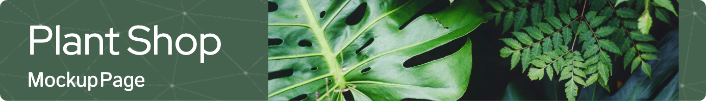

## 📝Project Overview
This project is a mockup of a plant shop designed to showcase my front-end development skills. Built using React and Tailwind CSS, the app offers a variety of features that simulate the user experience of browsing and interacting with an online store. You can check out the live version of the project [here](https://showcase-store-miedziak.netlify.app/).

## 💡Key Features
 🌱🏠 **Home Page:** A typical layout for a home page with sections showcasing a banner with a quick link to the shop, a hero section, visually appealing shop benefits, and **blog post mockups fetched from an API**.  
 🛒🌿 **Plant Shop:** A page where users can browse through a collection of plants, view details for each plant, and explore individual plant pages.  
 🪴📄 **Individual Product Pages:** Each plant has its own page displaying detailed information and options for adding to the cart.  
 📝📮 **Contact Form:** A simple, functioning contact form that allows users to reach out with inquiries.  
 🤔💡 **FAQ Page**: A page with collapsible answers to frequently asked questions, making it easy for users to find quick information.  
 🛒🧾 **Cart Page:** Users can add plants to their cart, view the contents, edit it, and see a subtotal of the items. 

## 🛠️Tech Stack

**Main Technologies:**
 - React (Built with JavaScript/TypeScript)
 - Tailwind CSS
 - TypeScript

**Libraries/Tools Used:**
 - SWR (Data fetching)
 - Zustand (State management)
 - React Hook Form (Handling forms)
 - React Router (Routing between pages)
 - Zod (Schema validation)

**Additional Features:**
 - Portals (For rendering notifications outside the DOM hierarchy)
 - Responsive Layout (Tailwind makes it easy to adjust for various screen sizes)

**Version Control & Deployment:**
 - Git & GitHub (Version control and repository hosting)
 - Netlify (Deployment and continuous integration)

## 🧩🧠Challenges & Solutions   
**🧩: Enabling navigation between different pages (e.g., Home, Shop, Plant Page) in a single-page application without full page reloads.** 
🧠: Integrated React Router to manage dynamic routing, allowing transitions between components. Configured routes for each page and utilized the useParams hook to display individual plant pages based on URL parameters.
  

**🧩: Fetching blog post data from an external API and rendering it.** 
🧠: Implemented a custom hook using the SWR library for data fetching and caching. The hook separated logic to process and enrich the fetched data with additional fields like the author and images. This structured data was dynamically mapped and rendered as blog post components on the Home page.
  

**🧩: Challenge: Making the app visually appealing across all screen sizes while maintaining consistent styling.** 
🧠: Used Tailwind CSS classes directly within TSX to style components, ensuring a responsive design while keeping the code simple. Customized the Tailwind configuration for project-specific needs and maintained a consistent design throughout the application.
  

**🧩: Creating a realistic shopping experience by handling user interactions, such as adding items to the cart and reflecting these changes in the UI.**  
🧠: Implemented a Zustand store to manage the global state of the cart. Developed functions for adding, removing, and updating cart items, ensuring the UI dynamically reflected the current cart state across the application. This approach improved state management and maintained a clean, scalable architecture.
  

**🧩: Creating a functional contact form with input validation to enhance the user experience.** 
🧠: Used React Hook Form in combination with Zod for input validation. Implemented controlled components for form inputs and ensured required fields were validated before submission. Integrated email submission using EmailJS and provided real-time feedback to users with notifications for both successful and failed form submissions.
  

**🧩: Making the application accessible online for demonstration purposes.** 
🧠: Deployed the application to Netlify, configuring the build settings to support React Router's dynamic routing. Ensured that environment variables were correctly set up for the production environment.
  

**🧩: Providing real-time notifications to users.** 
🧠: Created a Notification component and store using Zustand for managing notification state globally. Integrated the notification system with the cart and contact form. To ensure a smooth user experience, a React Portal was used to render the notifications outside the main DOM structure, allowing them to appear in a consistent location across the application, independent of the component hierarchy.
  

## 🚀Future Enhancements
 - Improve images loading speed
 - &&more to come

## 📬Contact Me
Feel free to reach out for any inquiries or opportunities. I’d love to connect!

 - Email: [miedziak.magdalena@gmail.com](mailto:miedziak.magdalena@gmail.com)
 - LinkedIn: [Magdalena Miedziak](https://www.linkedin.com/in/magdalena-miedziak/) 
 - GitHub: [MagdaMie](https://github.com/MagdaMie)
